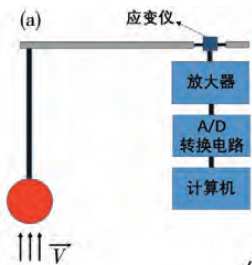
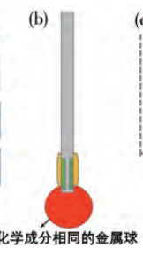
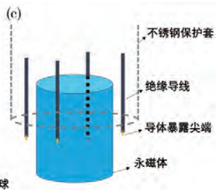
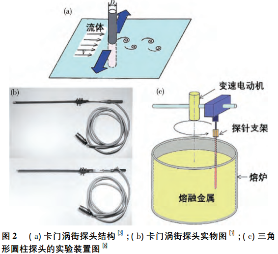
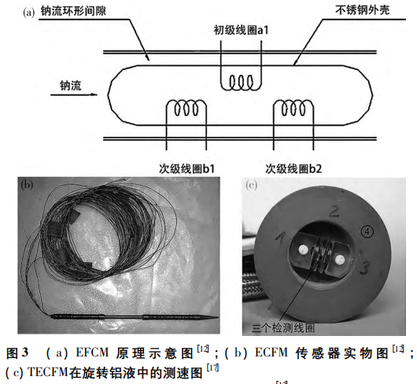
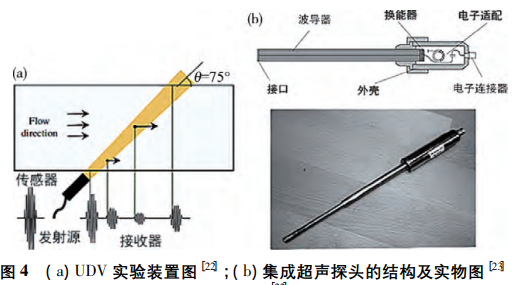
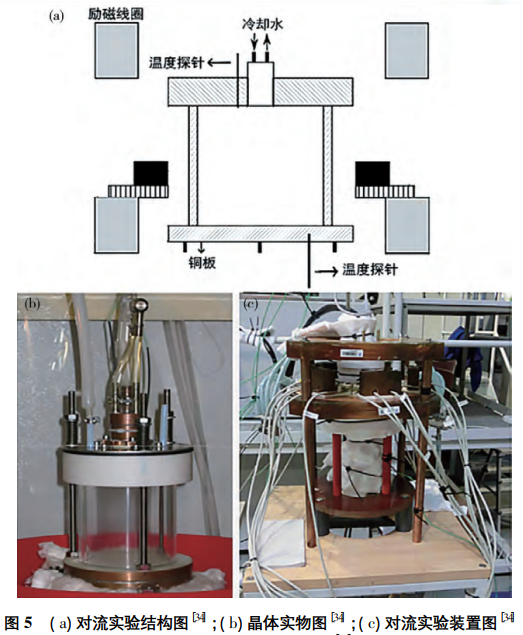
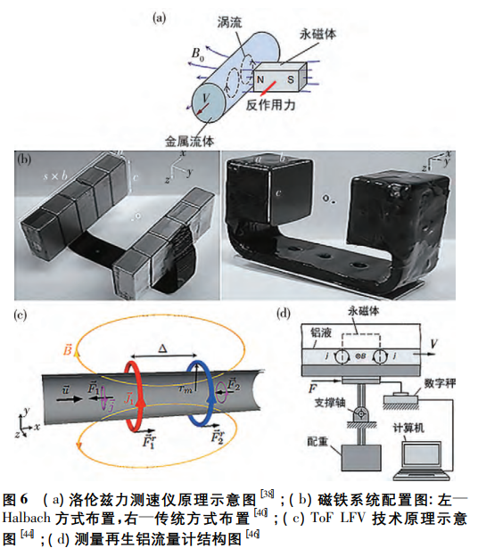

# 铁水流速检测

## 问题
1. 此前宝钢团队尝试过的方法有哪些？
1. 这些方法的实验流程是什么样的？
1. 在流程中的哪一步/哪几步出现了问题？
1. 如何做标定？稳定的参考点？视场？
1. 两帧时间保证准确

## 提问稿准备

1. **项目背景与目标了解**：
   - “能否向我介绍一下该项目的起始背景和主要目的？”
   - “在当前生产过程中，铁水流速的监测和控制对于整体生产质量和效率有何影响？”

2. **之前尝试的方法详细介绍**：
   - “请详细描述一下您在传统流体力学测速方法中采用的具体技术和步骤？”
   - “在机器视觉测量中，您使用了哪种图像捕捉技术，以及后处理软件是如何集成和运作的？”

3. **技术挑战与安全保障**：
   - “在实施这些测速方法时，您遇到了哪些技术难题？哪些是直接关联到生产安全的？”
   - “针对高温和强腐蚀性环境，您是如何保障测试设备和操作人员的安全的？”

4. **数据准确性与问题识别**：
   - “在收集和分析数据的过程中，您是如何评估数据准确性和可靠性的？”
   - “是否可以分享一些具体的实验数据或测试记录？”

5. **资源投入与限制因素**：
   - “在之前的尝试中，资源分配是否对项目的进展有所制约？如有，是在哪些方面？”
   - “是否存在外部因素，比如环境变化、原材料变动等对测速准确性造成的影响？”

6. **尝试过程中的调整与优化**：
   - “在尝试这些方法的过程中，贵团队是否有过什么调整或优化措施？效果如何？”
   - “在操作过程中，有没有出现过对生产流程产生负面影响的情况？”

7. **未来方向与合作期望**：
   - “基于之前的经验，您认为有哪些潜在的解决思路或备选方案？”
   - “在探索新的解决方案时，您最关心哪些方面？比如是成本、准确度、操作便捷性或安全性等？”

8. **文档资料与后续沟通**：
   - “能否提供之前方案尝试的详细文档，包括但不限于设计图纸、操作手册、安全协议、测试结果等？”
   - “建立一个定期交流进展和技术细节的机制是否可行？这对于双方都有益。”

## 接触式测量

### 1 探针法
探针法作为古老传统的测速技术，具有结构简单、操作便捷等特点，主要根据浸入式的探针与流体速度的某些特定关系来反映流速，分为反应探针法、熔融探针法、Vives 探针法等几大类

1. 反应探针法是借助作用在探针上的拖曳力与流速之间的线性关系确定流速，最初使用的探针形状为圆盘形，但测量结果极易受流动方向的影响，球体的阻力系数不依赖于流动方向，可以采用球体代替圆盘形来克服流动方向对测量精度的影响，该方法结构简单，曾在工业测量中广泛应用，但测量结果极易受流速的增长和弯月面的波动影响，很难在高温高速的湍流流体中得到精准的结果
    

1. 熔融探针法是将具有相同化学成分的金属球浸入金属液中，根据金属球的熔化速率与流速之间的线性关系确定流速，该方法适合于约 700 ℃ 的高温熔体，但是金属球的几何形状与熔体温度之间的关系不易掌控，而且金属球在高温时熔化较快，不利于工业上的连续测量
    

1. Vives 探针法根据电磁感应的原理，当导体在磁场中移动时，产生的电场强度与导体速度呈线性关系，通过测量不同导体尖端 A 和 B 之间的电位差即可确定与电位相关的流体速度，结构图如图 1c 所示，该方法适用于温度低于永磁体居里温度的熔融金属流，相对于热膜探头有更长的使用寿命( 约一年) ，不易受流体温度和物理性质波动的影响，不足之处在于其仅适用于测量较短时间内的平均速度，且易受外部磁场干扰，无法测量高速湍流流动
    

### 2 卡门涡街探头法

卡门涡街探头法和探针法具有相似的原理，但其测量结果不易受流体温度变化、化学成分、液面波动等因素影响，具有更高的工业适用性。实际工作时，圆柱体探头后方形成的尾迹会随雷诺数的变化产生不同模式的流动特征，当雷诺数大于 40 时，探头会因卡门涡街的脱落产生周期性的振荡，通过对振动频率的测量，并根据雷诺数、脱落频率、流速三者之间的关系式确定流速。卡门涡街探头法的测量结果不受熔融金属化学成分、温度变化和液面波动的影响，结构简单，成本较低，精度可满足一般工业要求，适用于 1000 ℃ 左右的高温熔体的流速测量

雷诺数：雷诺数（Reynolds number）一种可用来表征流体流动情况的无量纲数。Re=ρvd/μ，其中v、ρ、μ分别为流体的流速、密度与黏性系数，d为一特征长度。例如流体流过圆形管道，则d为管道的当量直径。利用雷诺数可区分流体的流动是层流或湍流，也可用来确定物体在流体中流动所受到的阻力

### 3 涡流流量法
适合于反应堆的高辐射区的测速装置是涡流流量法( Eddy current flow meter，ECFM) ，该系统由交流发电机激励的一个初级线圈和两个次级线圈组成，当钠液运动时，两个次级线圈产生运动电压，上游线圈的电压为运动电压与变压器电压之差，下游线圈的电压为运动电压与变压器电压之和，两线圈的电压之差与钠流速成正比，利用电压差与流速的线性关系确定金属液的速度

## 非接触式测量

### 1 超声波多普勒测速技术
超声波多普勒测速技术(Ultrasound doppler velocimetry，UDV) 的原理是利用超声脉冲回波技术对运动粒子的反向回波信号进行调解和数值转换，保留运动粒子的多普勒频移，并根据颗粒速度与该多普勒频移的关系式推导出流体的速度。该方法与常规光学方法和浸入式的探针法相比具有很大优势，可以测量不透明金属液的流速且成功避免对流体的扰动，但是对温度有严格的限制，不适合强化学腐蚀性流体的测量，目前常用作验证其他测速技术正确性的辅助工具。

Eckert 等设计了一种由波导和电子元件组成的超声波传感器利用换能器与流体间发生的热与化学解耦成功测得了 750 ℃ 液态铝的流体速度

### 2 非接触感应流层析成像技术

非接触感应流层析成像技术( Contactless inductive flow tomography，CIFT) 是一种可以重构三维速度场的可视化非接触的测速方法。工作原理为在流动导体上施加一个或多个主磁场，测量相应的感应磁场的扰动，通过解决数学上的线性反问题来构建流场，其中存在的非唯一性问题可以通过 Tikhonov 正则化和 L 曲线技术解决。该技术不受流体的不透明、高温、强腐蚀性等特性的影响，适用于实时跟踪各种缓慢的流体变化，在晶体生长和冶金领域都有所应用和发展

### 3 洛伦兹力测速技术

法拉第对磁流体动力学( Magnetohydrodynamics，MHD) 的发展具有重大贡献，在 19 世纪，他尝试测量由泰晤士河在地球磁场中的运动引起的电压，这是历史上第一次应用磁流体动力学进行的实验，洛伦兹力测速仪( Lorentz force velocimetry，LFV) 应用相近的原理，当移动导体在磁场中运动时，会受到一个阻碍其运动的洛伦兹力，根据牛顿第三定律，磁系统同时会受到一个与该洛伦兹力大小相等且方向相反的反作用力，根据该反作用力与导体电导率、移动速度之间的线性关系确定移动导体的速度。洛伦兹力测速技术具有无接触、原位、实时测量等优点，主要针对高温、不透明、腐蚀性金属液的测量，与常规方法相比具有巨大优势。

###  近红外相机
1. 在单色 CMOS 传感器前加装红外滤镜来抑制水面光学噪声，从而提高相关曲面的峰值信噪比

1. 多数陆生植物以及滨海浅水的海草却总在近红外波段出现反射峰

1. 内嵌 850~1050nm 的近红外滤镜
